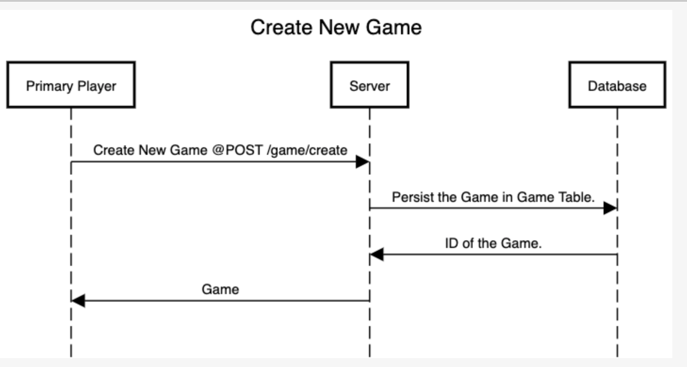
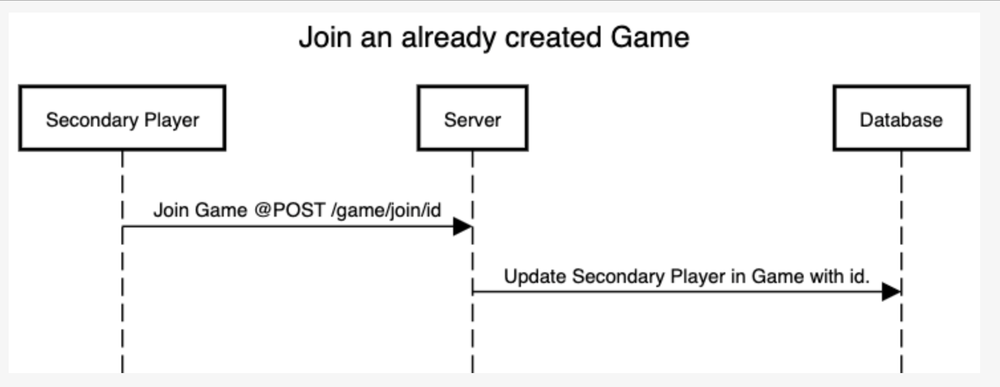
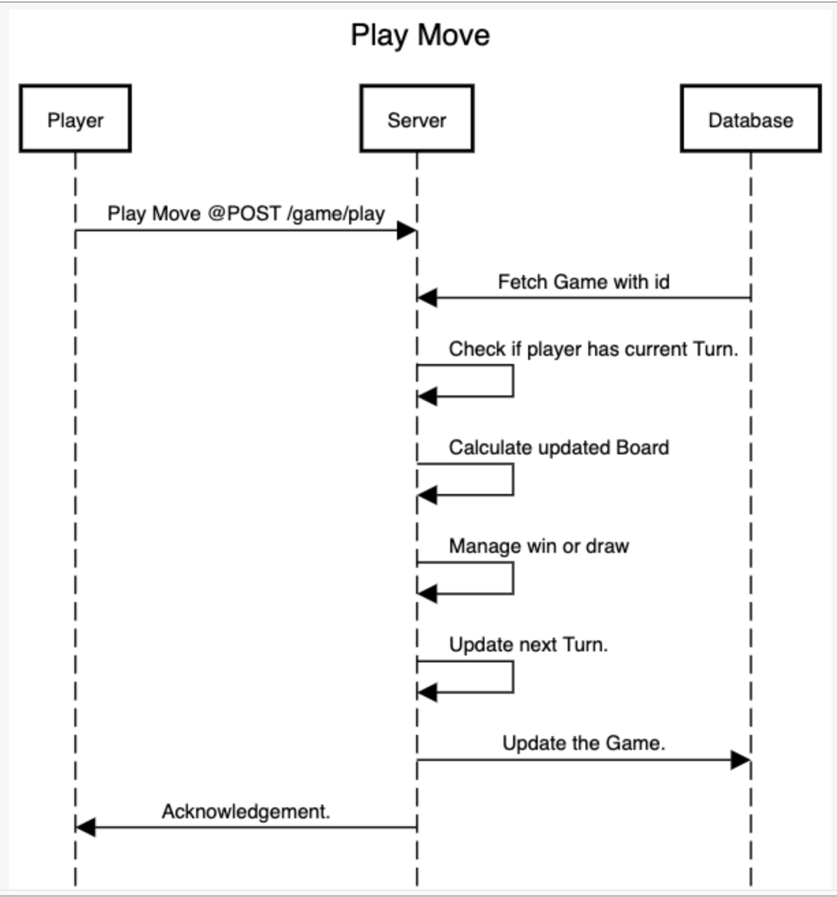

# CreditShelf Backend Challenge - Tic-Tac-Toe Server

This project uses Quarkus, the Supersonic Subatomic Java Framework.

If you want to learn more about Quarkus, please visit its website: https://quarkus.io/ .

## Setup

### Step 1
Install Java (>= Version 11)

### Step 2
Start a MySQL instance either manually or using the docker-compose.yml file provided.

Update the connection details in src/main/resources/application.properties

If you face port already in use, change port value in application.properties.

Start MySql container with``` docker-compose up```
### Step 3
Run Tests using ```./mvnw test```
Run Application in Dev Mode using ```./mvnw compile quarkus:dev```

### Step 4
Api Documentation has been generated using openAPI suite and can be accesses at Path: /swagger
after starting the application in dev mode.

## Running the application in dev mode for testing with Postman

You can run your application in dev mode that enables live coding using:
```shell script
./mvnw compile quarkus:dev
```

## Running the tests

You can run the application tests using:
```shell script
./mvnw test
```

## Packaging and running the application

The application can be packaged using:
```shell script
./mvnw package
```
It produces the `quarkus-run.jar` file in the `target/quarkus-app/` directory.

The application is now runnable using `java -jar target/quarkus-app/quarkus-run.jar`.

## Provided Code

### Tic-Tac-Toe Server exposed as a RestFul Web-Service Persisting data to MySQL using Hibernate

##Board management
Board is managed as a String.

X|X|X\
O|O|O\
X|O|X

Above board will be represented as "1,1,1,2,2,2,1,2,1"
1 represents O
2 represents X







